<hr>

<h1 align="center">
  <br>
  <a href="http://txpipe.io"></a>
  <br>
  Adalicious
  <br>
</h1>

<h4 align="center">Effortlessly create secure links to receive payments in ADA</h4>

<p align="center">
  <a href="#introduction">Introduction</a> •
  <a href="#implementation-details">Implementation Details</a> •
  <a href="#deploy-your-adalicious">Deployment Guide</a> •
  <a href="#license">License</a>
</p>
<hr>

## Introduction

Adalicious is a simple tool designed for those who want to easily receive payments in ADA. With Adalicious, you can create a simple payment link that you can share with your customers, allowing them to pay you in ADA quickly and securely. Whether you're a freelancer, a business owner, or simply someone who wants to accept payments in ADA, Adalicious provides a user-friendly and reliable solution. 

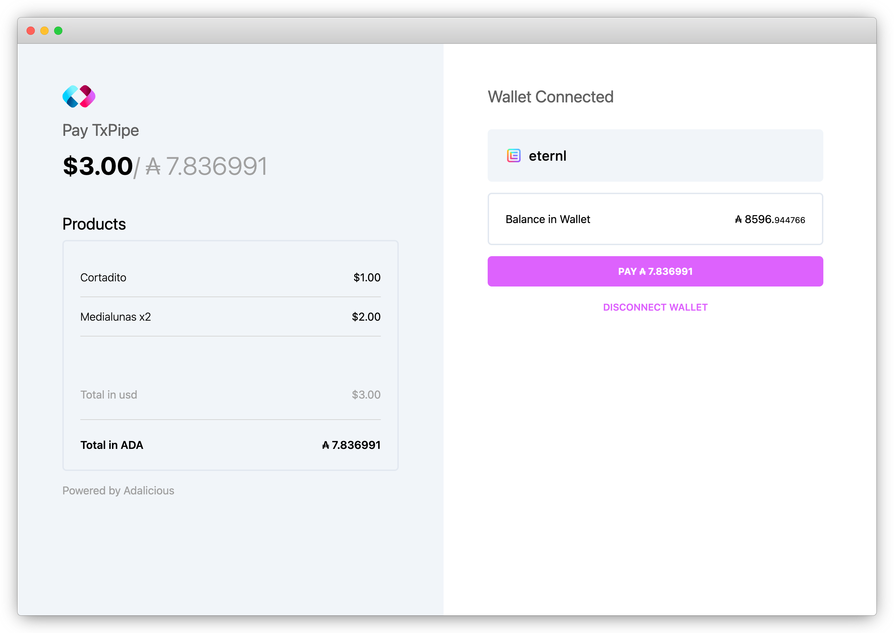

This tool is presented as a <b>Starter-kit</b>, so you can easily customize and extend its functionality to your needs; or just follow the guide in this document to deploy your own instance of Adalicious with your <b>Company Name</b> and <b>Logo</b>.

Adalicious was built with the help of the following tools:

 - [MeshSDK](https://meshjs.dev/)
 - [Oura Webhooks](https://github.com/txpipe/oura)
 - [Demeter Containers](https://demeter.run)

## Implementation Details

This Starter Kit is implemented as a [NextJS Application](https://nextjs.org/). 

Its architecture is composed of 4 main components:

 - A web-form for generating JWT Signed Payment Links.
 - A web-form for submitting the Payment; managing the connection with the wallet, building, signing and submitting the transaction.
 - An oura Webhook listening for transactions in the user wallet. 
 - A Discord Webhook for publishing a message whenever a Payment has been submitted and confirmed. 

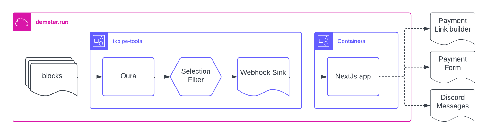

In this documentation we will also go through the process of how to deploy and access this app from [Demeter Containers](https://demeter.run).

### Wallet Interactions

We have implemented all the interactions with the user Wallet with the help of [MeshSDK](https://meshjs.dev/).

By using the [Browser Wallet](https://meshjs.dev/apis/browserwallet) component you can easily build, sign and submit transactions on the front-end.  

As part of the transaction metadata we are sending a JSON object with a `pid` value, which works as a unique id you can generate at the moment of building the Payment Link. This information can be used later, so when the transaction is confirmed in the blockchain you can access this `pid` value for executing a process in your core system. <i>ie: the `pid` value could represent the id of the user in your system, so when the transaction is confirmed you can add some credits to their account. </i>

### ADA Conversion Rate

The Adalicious platform provides a convenient feature that enables you to specify the price of your products or services in a fiat currency when building the payment link. 

When a customer submits a payment, the conversion rate to ADA is fetched in real-time from the [CoinGecko API](https://www.coingecko.com/). 

It's worth noting that Adalicious is easily extendable, allowing you to fetch conversion rates from different sources beyond CoinGecko. To do so, simply provide a new implementation to the `ADARateFetcher` interface defined in the `ada-rate.ts` helper. This feature enhances the versatility of Adalicious, ensuring that users can access the most up-to-date and accurate conversion rates to streamline their payment process.


### Payment Links

Adalicious offers a convenient Payment Link Builder tool that enables you to set up custom products and prices for each of your customers.

These links are designed as one-time payment links, and have an expiration time of one hour to ensure the security of your transactions. The information for each product is encoded and signed into the link using the JWT Secret specified in the form. Keep it secret! It is crucial to ensure that the JWT value you use is consistent with the one you set when deploying your Container to ensure the proper functioning of the Payment Link. 

If you want to learn more about jason web tokens take a look at [jwt.io](https://jwt.io/)

### Transaction Notifications

Adalicious implements a basic notifications schema by integrating Discord Webhooks. You will have to setup your Discord Webhook Id and Token when setting up your Adalicious Container. 

If you want to learn how to setup a Discord Webhook take a look at their [official documentation](https://support.discord.com/hc/en-us/articles/228383668-Intro-to-Webhooks).

Adalicious reports 2 different events:
- When the Payment transaction has been submitted. 
- When the Payment transaction has been confirmed. 

The submission event is published at the moment the transaction is submitted from the web-app. 
The confirmation event is published when Oura reports the transaction in the address of your wallet. 

Both events will include the `pid` value set in the transaction metadata, together with the `transaction hash`. 

If you need to implement a more advanced integration with your system you can replace the function `publishEvent` in the `event-published.server.ts` file. 

```typescript
export async function publishEvent(event: APIEvent, body: any): Promise<void> {
    await yourCustomEventPublished(event, {body.pid, body.txHash})
}
```

### Easy to customize

Its easy to customize your Payment Forms with the look and feel of your brand. We designed Adalicious so those variables can be set at the moment of setting up your Container. 

In the current implementation you can customize the following values:

`TENANT_NAME`
`TENANT_LOGO`

We are planning on adding more customizations options in the future, but for now we are keeping it simple!


##  Deploy your Adalicious

We really want to make it easy for anymore to deploy their own payment forms. As part of this starter kit we provide a public docker image you can use for deploying your own instance of Adalicious.

```
ghcr.io/txpipe/ada-payments-starter-kit:238b35b0703de1fbf91fb00a2cb4c8b0e0e32ada
```

### 1 - Create a Container in Demeter

The first step to deploy your Adalicious instance would be to create a new <b>Container</b> in [Demeter](https://demeter.run). This feature allows developers to host their dapps without having to worry about the infrastructure. 

Assuming you have a Project already created in Demeter open the `Development console` for that project and press the `Create Container` button on the `Console Dashboard`. 

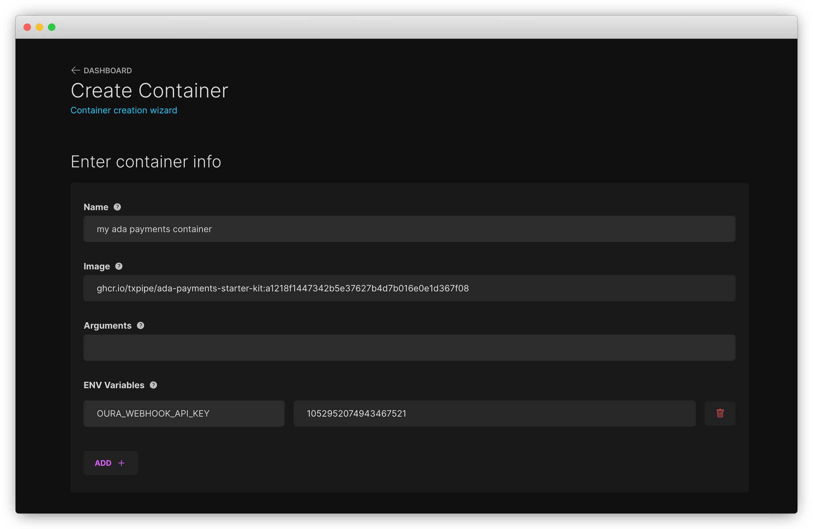

When creating the Container we need to input the following values:

| Name             | Description                                                                                                             |
| ---------------- | ----------------------------------------------------------------------------------------------------------------------- |
| `Name`           | Enter a name for identifying your container                                                                             |
| `Image`          | The public docker image. we will use `ghcr.io/txpipe/ada-payments-starter-kit:a1218f1447342b5e37627b4d7b016e0e1d367f08` |
| `Replicas`       | Number of replicas to deploy. We will select <b>1 Replica</b>                                                           |
| `Container Size` | The size of the container to deploy. We will select <b>Small</b>                                                        |
| `Network`        | The network to connect. We will select <b>Mainnet</b>                                                                   |

We also need to add the following <b>ENV Variables</b> with the app configuration:

| Key                     | Value                                                                                                                                                                     |
| ----------------------- | ------------------------------------------------------------------------------------------------------------------------------------------------------------------------- |
| `DISCORD_WEBHOOK_ID`    | The Id of the webhook you have created. Check the [Discord Documentation](https://support.discord.com/hc/en-us/articles/228383668-Intro-to-Webhooks) for more information |
| `DISCORD_WEBHOOK_TOKEN` | This is the token of your discord webhook                                                                                                                                 |
| `ADA_RATE_API`          | This image fetches the ADA / USD Rate from [CoinGecko](https://www.coingecko.com/). The value for this field is "https://api.coingecko.com/api/v3/simple/price"           |
| `TENANT_NAME`           | The name for your company which should be displayed in the Payment Form                                                                                                   |
| `TENANT_LOGO`           | Your company logo which should be displayed in the Payment Form                                                                                                           |
| `RECIPIENT`             | Your wallet address for receiving the payments                                                                                                                            |
| `OURA_WEBHOOK_API_KEY`  | A secret api-key we will be using for setting up the Oura Webhook so we can get notified when a tx is confirmed                                                           |
| `JWT_SECRET`            | A secret phrase we will be using for signing the payment links.                                                                                                           |

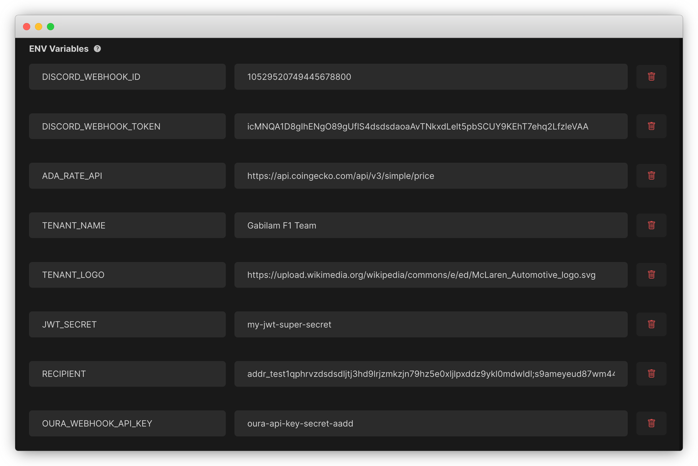

Once you have input all the required values press the <b>CREATE</b> button. Demeter should get your container started. 

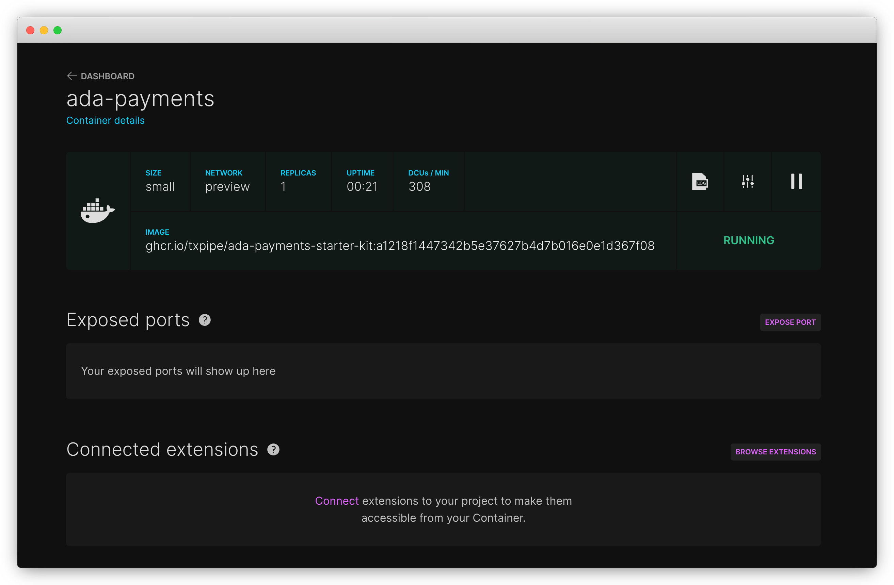

Congratulations! Your application is now deployed!

### 2 - How to Access your Application from a public url

Our application is now deployed, but still we can not access the Payment Form. For accessing the app from a public url we will use the <b>Expose Port</b> functionality available in the <b>Demeter Containers</b>.

Inside your Container press the <b>Expose Port</b> button. 

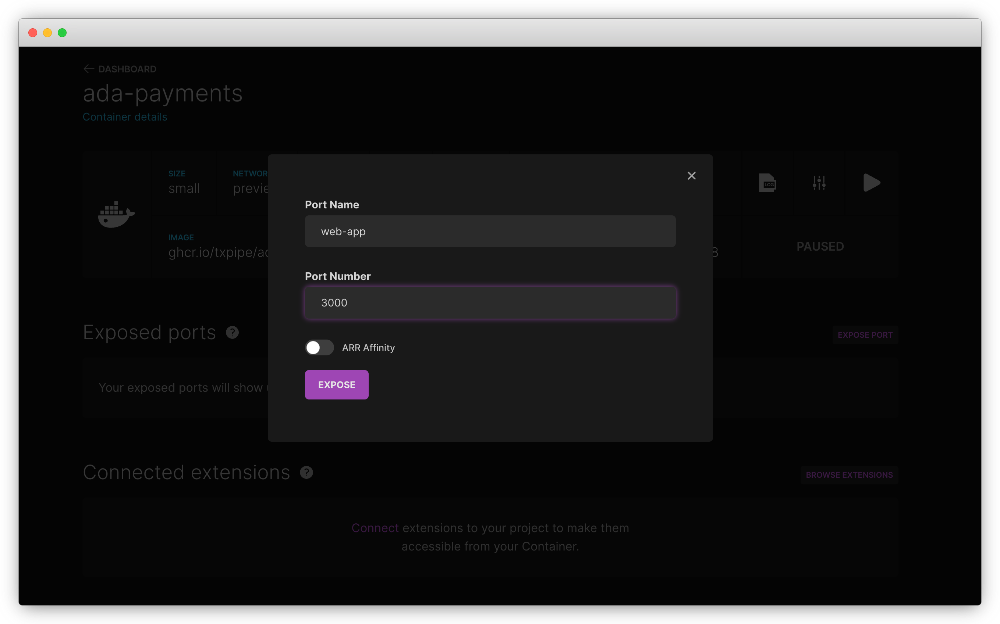

We need to enter the port number `3000` and a name. Once you are ready press <b>EXPOSE</b>

Demeter will generate a new public URL link you can use for accessing your App. 

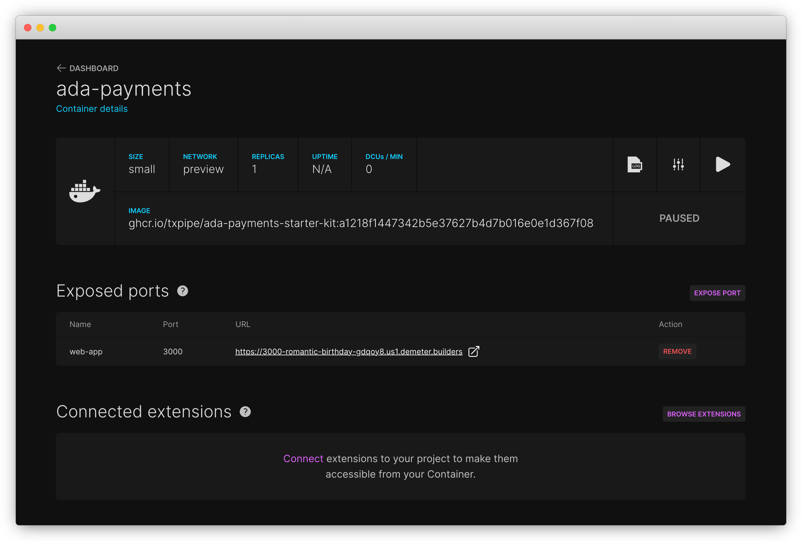

By clicking the `URL` of your exposed port you should be able to access your Application. 

### 3 - Generating Payment Links

At this point we have deployed a container with all the configuration, and we have exposed the port so we can access it from outside of Demeter. Give it a try and access your application. 

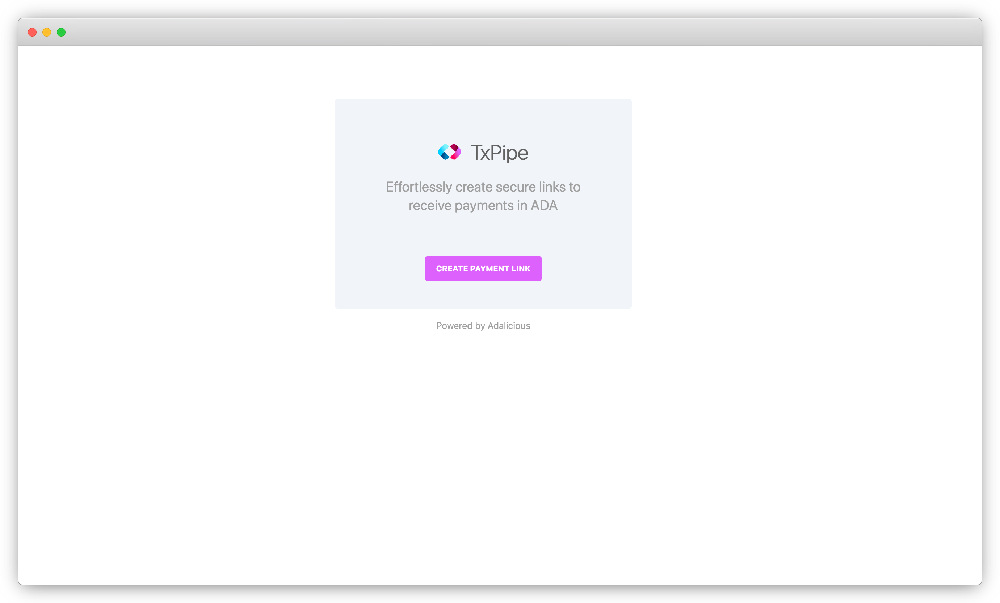

Whenever you need to receive a payment you need to create a new Payment Link, so lets press the <b>Create Payment Link</b> button to build our first shareable link.

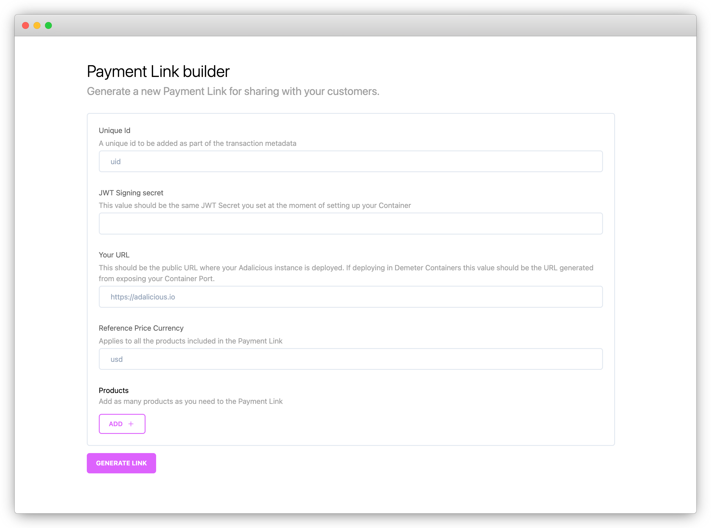

In this form we need to input the following values:

| Name                       | Description                                                                                                                           |
| -------------------------- | ------------------------------------------------------------------------------------------------------------------------------------- |
| `Unique id`                | A unique id you want to be included in the transaction metadata.                                                                      |
| `Product Name`             | The name of the product you want to display in the Payment Form                                                                       |
| `Reference Price Currency`             | The currency we will use for setting up the price per product                                                                       |
| `service URL`              | This should be the public URL where your container is running in Demeter. ie: `https://3000-romantic-birthday-gdqoy8.us1.demeter.run` |
| `JWT_SECRET`               | This should be the same value you entered in your container ENV Variable.                                                             |

You also need to add all the Products you want to charge. For each one of the products you need to specify a Name and its price in the reference currency in cents. 

Once you have input all the values you can press the <b>GENERATE LINK</b> button. 

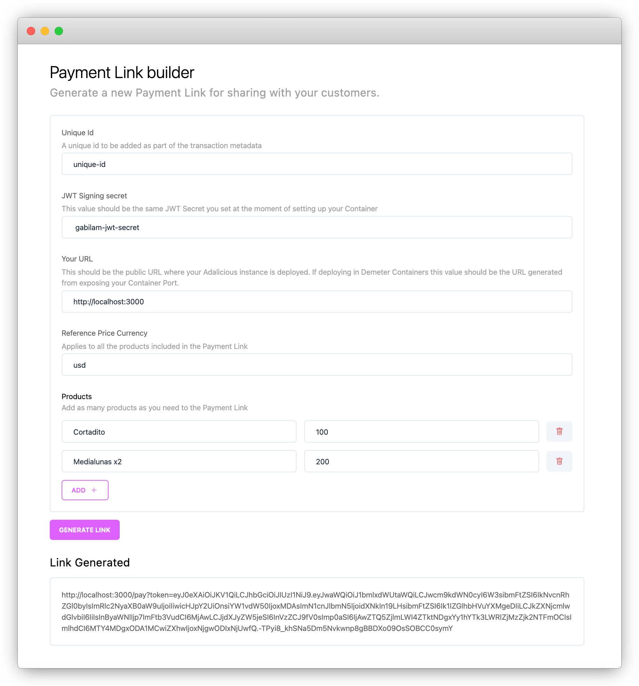

You can now use this link to share it with your customer! Keep in mind this link will be valid for only one hour, so you we will have to generate a new link for every time you need to request a payment.    

### 4 - Get the Payment Notifications

There is one more step before we complete the process. In order to get notified whenever a payment was received we will be setting up an `Oura Webhook` in Demeter.

Inside the `Demeter development console` go back to the `Dashboard` and select to browse the `Extensions`. From the list of extensions select `Cardano Webhooks`. 

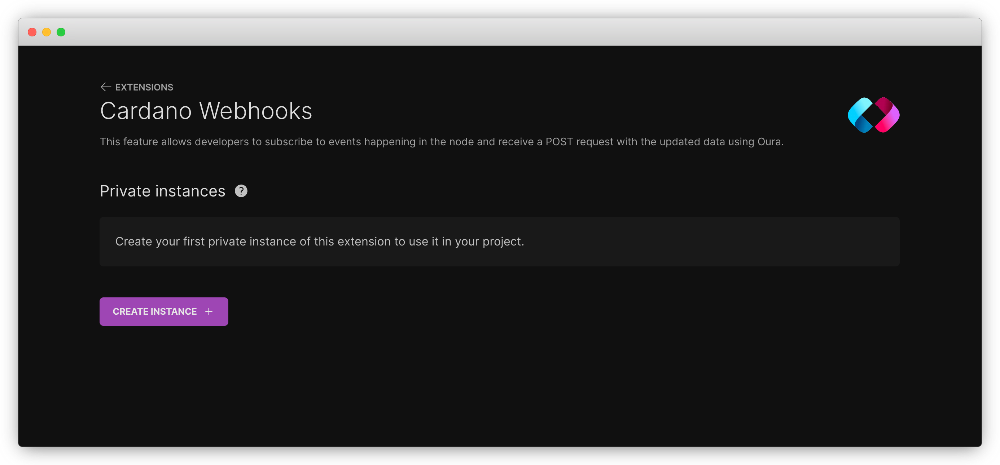

Press the <b>CREATE INSTANCE</b> button for setting up a new Webhook. 

When creating the webhook we need to input the following values:

| Name             | Description                                                                                                        |
| ---------------- | ------------------------------------------------------------------------------------------------------------------ |
| `URL`            | The public URL where your container is running. Keep in mind you need to add `/api/oura` at the end of the URL.    |
| `x-oura-api-key` | You need to add a header with this key. The value should be the same you specified when setting up your container. |
| `Network`        | The network to connect. We will select <b>Mainnet</b>                                                              |

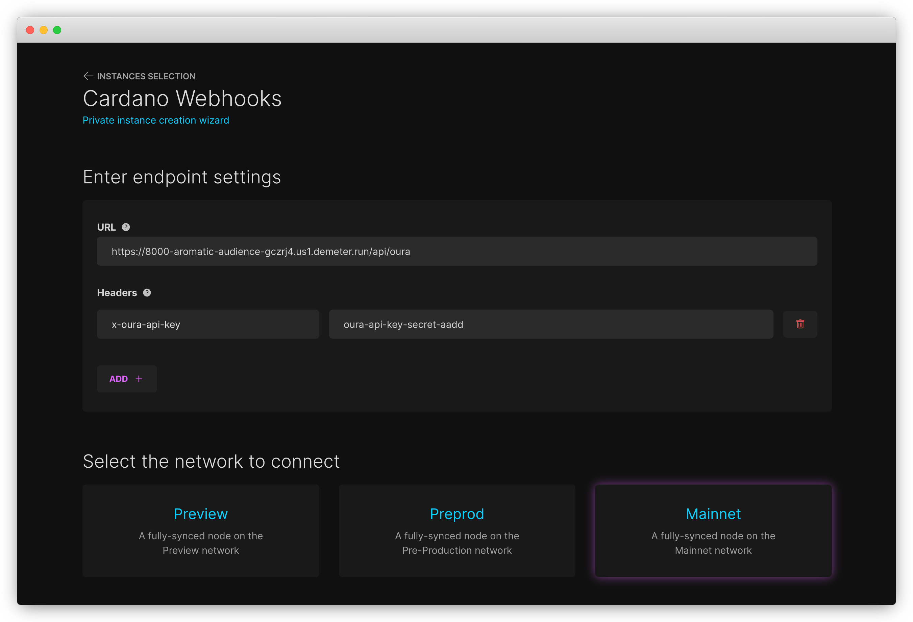

We will select to subscribe to the <b>Transaction</b> event. And make sure you add your wallet address to the input field.

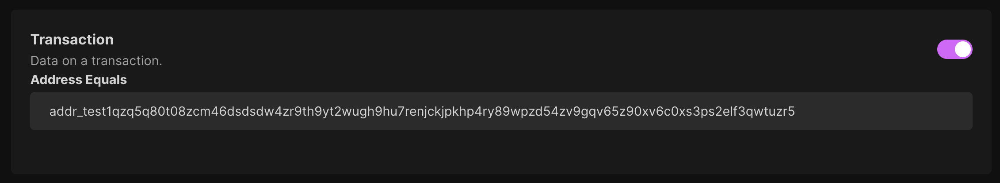

You are now ready to create the instance. 

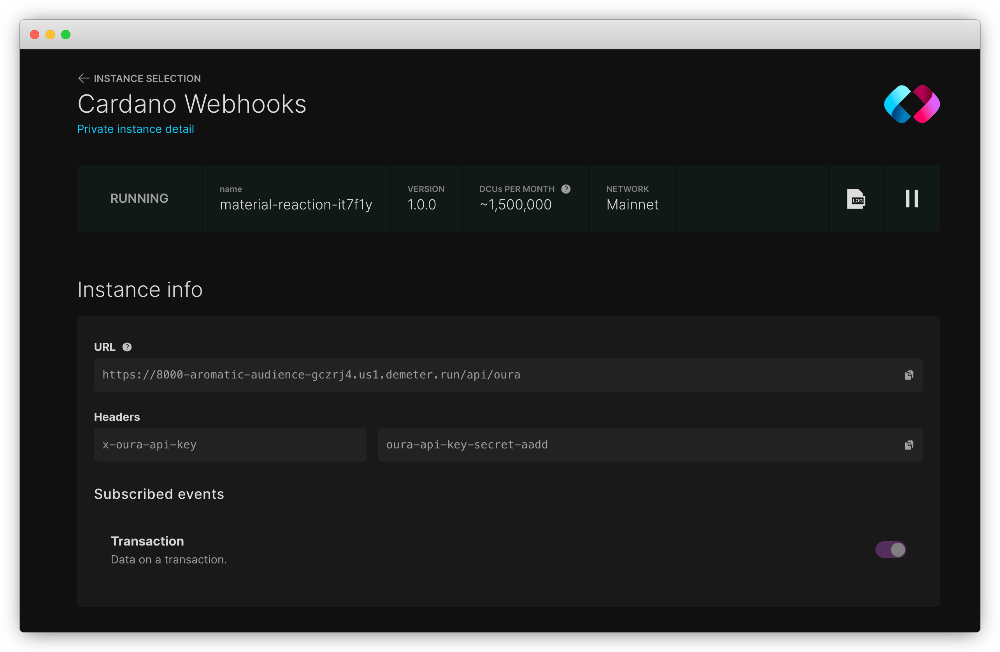

Once your Webhook is Running you should be ready to go. Every time a payment is received in your wallet address you will get a notification pushed to your discord server.

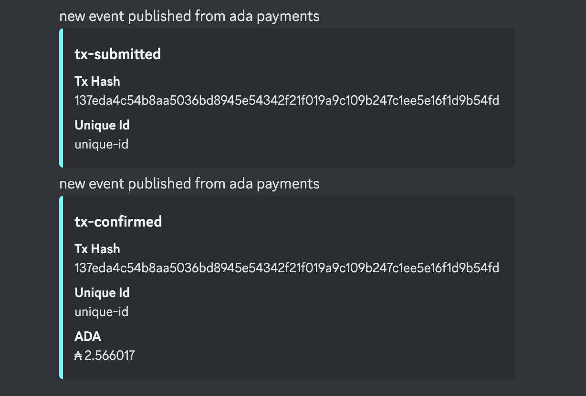


