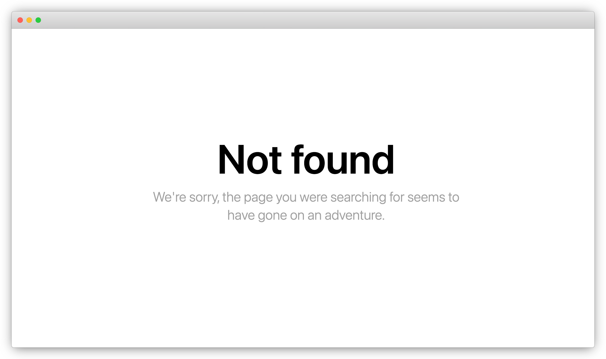
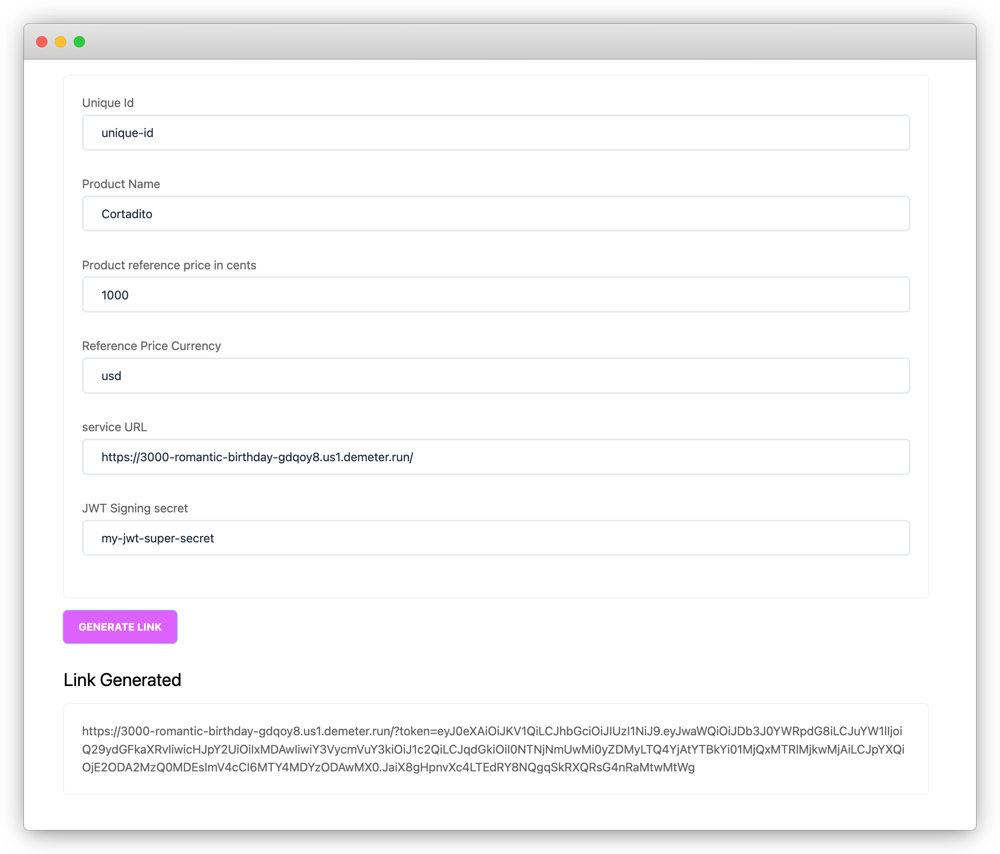

# ADA Payments Form - Starter Kit

This starter kit shows how to build and deploy a simple application for receiving payments in ADA through a web-form you can share with your customers.

By deploying this application you can generate public payment links which can be shared for receiving a payment for your products or services and get notified when the transaction is confirmed with a discord message.

For building and deploying this application we will be using the following services:
 - [MeshSDK](https://meshjs.dev/)
 - [Oura Webhooks](https://github.com/txpipe/oura)
 - [Demeter Containers](https://demeter.run)


## Getting Started

As part of this starter kit we provide a public docker image you can use for deploying your own payment form. 

```
ghcr.io/txpipe/ada-payments-starter-kit:a1218f1447342b5e37627b4d7b016e0e1d367f08
```

### Create a Container in Demeter

The first step would be to deploy a new Container in [Demeter](https://demeter.run). This feature allows developers to host their dapps without having to concern about infrastructure. 

Assuming you have a Project created in Demeter open the `Development console` for that project and press the `Create Container` button on the `Console Dashboard`. 


When creating the container we need to input the following values:

| Name                 | Description                                                                                    |
| -------------------- | ---------------------------------------------------------------------------------------------- |
| `Name`               | Enter a name for identifying your container                                                    |
| `Image`              | The public docker image. we will use `ghcr.io/txpipe/ada-payments-starter-kit:a1218f1447342b5e37627b4d7b016e0e1d367f08`                                                      |
| `Replicas`           | Number of replicas to deploy. We will select <b>1 Replica</b>                                  |
| `Container Size`     | The size of the container to deploy. We will select <b>Small</b>                               |
| `Network`            | The network to connect. We will select <b>Mainnet</b>                                          |

We also need to add the following <b>ENV Variables</b> with the app configuration:

| Key                       | Value                                                                                                             |
| ------------------------- | ----------------------------------------------------------------------------------------------------------------- |
| `DISCORD_WEBHOOK_ID`      | Whenever you receive a payment a notification will be posted to your Discord server; This should be the `ID` of the webhook you have generated in discord.                                                                                                                           |
| `DISCORD_WEBHOOK_TOKEN`   | This is the token of your discord webhook                                                                         |
| `ADA_RATE_API`            | This image fetches the ADA / USD Rate from coingecko. The value for this field is "https://api.coingecko.com/api/v3/simple/price"                                                                                                                                          |
| `TENANT_NAME`             | The name for your company which should be displayed in the Payment Form                                           |
| `TENANT_LOGO`             | Your company logo which should be displayed in the Payment Form                                                   |
| `RECIPIENT`               | Your wallet address for receiving the payments                                                                    |
| `OURA_WEBHOOK_API_KEY`    | A secret api-key we will be using for setting up the Oura Webhook so we can get notified when a tx is processed   |
| `JWT_SECRET`              | A secret phrase we will be using for signing the payment links.                                                   |


Once you have input all the required values press the <b>CREATE</b> button. Demeter should get your container started. 


Congratulations! Your application is now deployed!

### Access your Application from a public link

Our application is now deployed, but still we can not access the payment form. For accessing the app from a public url we will use the <b>Expose Port</b> functionality available in the <b>Demeter Containers</b>.

Inside your Container press the <b>Expose Port</b> button. 


We need to enter the port number `3000` and a name. Once you are ready press <b>EXPOSE</b>

Demeter will generate a new public URL link you can use for accessing your App. 


By clicking the `URL` of your exposed port you should be able to access your Application. 

### Generating Payment Links

At this point we have deployed a container with all the configuration, we have exposed the port so we can access it from outside of Demeter, but when we click in the URL we get a `Not Found` page. 



No worries, this is just because we have not generated any Payment Link. 

In order to generate a payment link we will access the `linkbuilder` URL. Just add `/linkbuilder` to the public URL generated by Demeter. ie: `https://3000-romantic-birthday-gdqoy8.us1.demeter.builders/linkbuilder`.

You should now have access to the payment links builder for your project. 


In this form we need to input the following values:

| Name                           | Description                                                                                    |
| ------------------------------ | ---------------------------------------------------------------------------------------------- |
| `Unique id`                    | A unique id you want to be included in the transaction metadata.                               |
| `Product Name`                 | The name of the product you want to display in the Payment Form                                |
| `Reference price in cents`     | The product price in the reference currency. This value should be in cents.                    |
| `Reference price currency`     | The reference price currency. We use the coingecko API to convert the reference price in this currency to its value in ADA.                                                                                                                              |
| `service URL`                  | This should be the public URL where your container is running in Demeter. ie: `https://3000-romantic-birthday-gdqoy8.us1.demeter.run`                                                                                                                              |
| `JWT_SECRET`                   | This should be the same value you entered in your container ENV Variable. 

Once you have input all the values you can press the <b>GENERATE LINK</b> button. 



You can now use this link to share it with your customer! Keep in mind this link will be valid for only 1 hour, so you we will have to generate a new link for every time you need to request a payment. 

### Get the Payment Notifications

There is one more step before we complete the process. In order to get notified whenever a payment was received we will be setting up an `Oura Webhook` in Demeter.

Inside the `Demeter development console` go back to the `Dashboard` and select to browse the `Extensions`. From the list of extensions select `Cardano Webhooks`. 


Press the <b>CREATE INSTANCE</b> button for setting up a new Webhook. 

When creating the webhook we need to input the following values:

| Name                           | Description                                                                                    |
| ------------------------------ | ---------------------------------------------------------------------------------------------- |
| `URL`                          | The public URL where your container is running. Keep in mind you need to add `/api/oura` at the end of the URL.                                                                                                                              |
| `x-oura-api-key`               | You need to add a header with this key. The value should be the same you specified when setting up your container.                                                                                                                        |
| `Network`            | The network to connect. We will select <b>Mainnet</b>                                                    |


We will select to subscribe to the <b>Transaction</b> event. And make sure you add your wallet address to the input field.


You are now ready to create the instance. 


Once your Webhook is Running you should be ready to go. Every time a payment is received in your wallet address you will get a notification pushed to your discord server.


